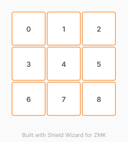

# ZMK Configuration for macropad-9

*Generated by Shield Wizard for ZMK*



Download compiled firmware from the Actions tab. <https://zmk.dev/docs/user-setup#installing-the-firmware>

Edit your keymap <https://zmk.dev/docs/keymaps>.
User keymap is located at [`config/macropad_9.keymap`](config/macropad_9.keymap).

-----

<details>
<summary>
Shield Wizard Debug Information
</summary>

In case of broken configuration, here is the Shield Wizard internal data used to generate this configuration:

Commit: 6771417768468d480226b5f17922324c10eb423e

```json
{"name":"macropad-9","shield":"macropad_9","dongle":false,"modules":[],"layout":[{"id":"01KX7FAA3YH5Y4KDHDNT8F58NR","part":0,"row":0,"col":0,"w":1,"h":1,"x":0,"y":0,"r":0,"rx":0,"ry":0},{"id":"01KX7FAA7ND4AM336BB2EWC0C8","part":0,"row":0,"col":1,"w":1,"h":1,"x":1,"y":0,"r":0,"rx":0,"ry":0},{"id":"01KX7FAAC9H6AD616AE8MWZDBA","part":0,"row":0,"col":2,"w":1,"h":1,"x":2,"y":0,"r":0,"rx":0,"ry":0},{"id":"01KX7FAEVW9JZJH0D0ZEDSN1J0","part":0,"row":1,"col":0,"w":1,"h":1,"x":0,"y":1,"r":0,"rx":0,"ry":0},{"id":"01KX7FBBQRYHEBK032AY3X2AQQ","part":0,"row":1,"col":1,"w":1,"h":1,"x":1,"y":1,"r":0,"rx":0,"ry":0},{"id":"01KX7FBCEM2C2BZDK3T0CW6RNP","part":0,"row":1,"col":2,"w":1,"h":1,"x":2,"y":1,"r":0,"rx":0,"ry":0},{"id":"01KX7FEA302XZV0M88BEB2MYDC","part":0,"row":2,"col":0,"w":1,"h":1,"x":0,"y":2,"r":0,"rx":0,"ry":0},{"id":"01KX7FEA72CSBTK9MHC21TH1W6","part":0,"row":2,"col":1,"w":1,"h":1,"x":1,"y":2,"r":0,"rx":0,"ry":0},{"id":"01KX7FEAPGKM4H8R03V5T1RX6F","part":0,"row":2,"col":2,"w":1,"h":1,"x":2,"y":2,"r":0,"rx":0,"ry":0}],"parts":[{"name":"unibody","controller":"nice_nano_v2","pins":{"d2":{"usage":"kscan","kscan":"01KX7FM75TBAA1E0N45NWF8X5D","role":"input"},"d3":{"usage":"kscan","kscan":"01KX7FM75TBAA1E0N45NWF8X5D","role":"input"},"d4":{"usage":"kscan","kscan":"01KX7FM75TBAA1E0N45NWF8X5D","role":"input"},"d21":{"usage":"kscan","kscan":"01KX7FM75TBAA1E0N45NWF8X5D","role":"output"},"d20":{"usage":"kscan","kscan":"01KX7FM75TBAA1E0N45NWF8X5D","role":"output"},"d19":{"usage":"kscan","kscan":"01KX7FM75TBAA1E0N45NWF8X5D","role":"output"}},"kscans":[{"kind":"matrix","id":"01KX7FM75TBAA1E0N45NWF8X5D","diodes":true}],"keys":{"01KX7FAA3YH5Y4KDHDNT8F58NR":{"input":"d2","output":"d21"},"01KX7FAEVW9JZJH0D0ZEDSN1J0":{"input":"d2","output":"d20"},"01KX7FEA302XZV0M88BEB2MYDC":{"input":"d2","output":"d19"},"01KX7FAA7ND4AM336BB2EWC0C8":{"input":"d3","output":"d21"},"01KX7FBBQRYHEBK032AY3X2AQQ":{"input":"d3","output":"d20"},"01KX7FEA72CSBTK9MHC21TH1W6":{"input":"d3","output":"d19"},"01KX7FAAC9H6AD616AE8MWZDBA":{"input":"d4","output":"d21"},"01KX7FBCEM2C2BZDK3T0CW6RNP":{"input":"d4","output":"d20"},"01KX7FEAPGKM4H8R03V5T1RX6F":{"input":"d4","output":"d19"}},"encoders":[],"buses":{}}]}
```

</details>
